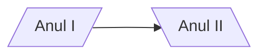

[Homepage](index.md)

# Diagrame de _lowchart_

```mermaid
flowchart LR
A[Anul I] --> B[Anul II]
```

```mermaid
flowchart LR
A(Anul I) --> B(Anul II)
```

```mermaid
flowchart LR
A[/Anul I/] --> B[\Anul II\]
```
